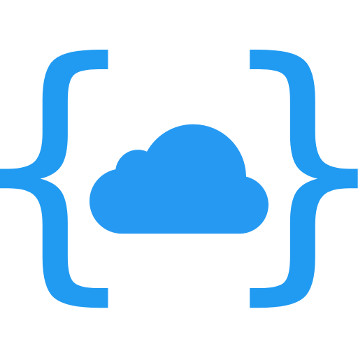

<div align="center">
	
	<h1>nameSpace</h1>
	<p>Открытая облачная платформа</p>
</div>

## О проекте

Это **учебный проект**, созданный с целью изучить real-time взаимодействие между клиентом и сервером,
веб-сокеты и фреймворк [Socket.io](https://socket.io/)

nameSpace - открытая облачная платформа для локальной сети. Она позволяет запустить свой сервер
и передавать файлы между подключёнными устройствами.


## Установка

**Важно!** Для корректной работы сервиса, необходимо установить, настроить и запустить
[сервер](https://github.com/shelepuginivan/namespace-server)

Склонируйте репозиторий

```shell
git clone https://github.com/shelepuginivan/namespace-client.git
cd namespace-client
npm ci
```

Запустить проект локально (dev-сервер)

```shell
npm run dev
```

Собрать проект

```shell
npm run build
```

Собранный проект появится в директории `./dist`.

Клиент можно поставить на хостинг (Netlify, Vercel и др.), пример - https://namespace-client.netlify.app

**Обратите внимание**, что для корректной работы облачного клиента необходим протокол `http`, `https` требует настройки
SSL-сертификата на стороне сервера. Это правило не относится к локальному хосту, соединение с которым защищено по
умолчанию.
